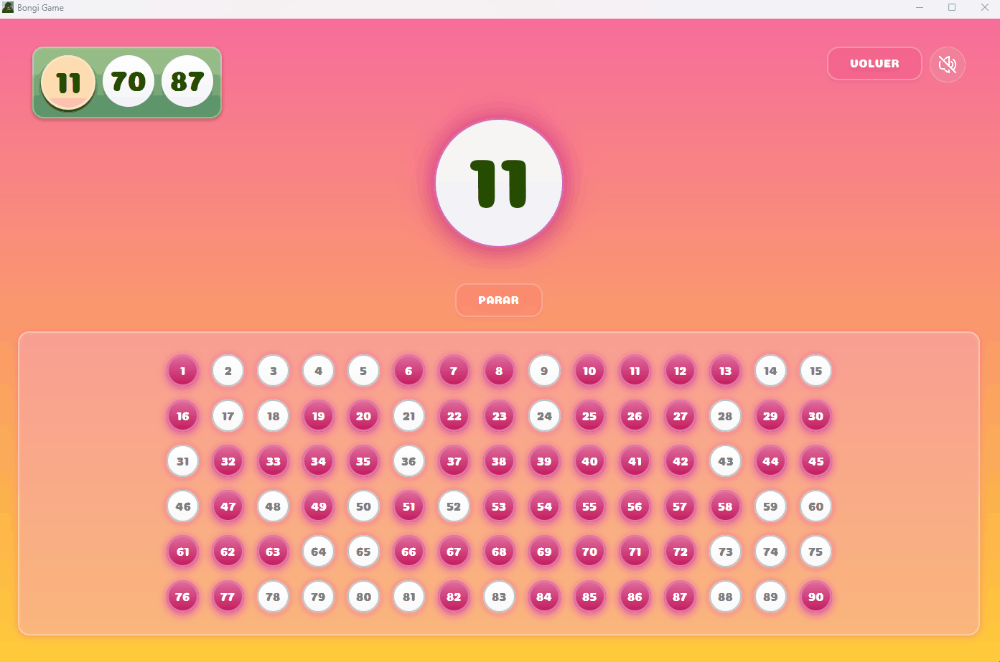

# 🌴 Bongi Game 🥥

Interactive Bingo game developed in Java with JavaFX.

## 💫 Motivation

This project was born from summer afternoons of family bingo. Since we usually play all together, I decided to create our own digital version to make the games even more fun. That's why it is in Spanish - it’s our family language!

## *Technologies Used*

- *Java 21 + JavaFX*
- *Photoshop*
- *Google Fonts*
- *Youtube Music*
- *Vecteezy*

## *Features*

- 🖥️ Modern graphical interface  
- 🎨 Smooth animations  
- 📝 Custom Bingo card generation  
- 🖨️ Option to print the cards directly from the app  
- 🔊 Sound effects  
- 🎵 Background music with playback control  
- 🗣️ Voice narration of the drawn numbers 
  
## *Screenshots*

<p align="center">
  <b>Home Screen</b><br>
  
  
</p>


<p align="center">
  <b>Game Screen</b><br>
  
</p>

<p align="center">
  <b>Generate cartons</b><br>
  
  
</p>

<p align="center">
  <b>Game Complete</b><br>
  
</p>

 
## *Download and Play*

1. Go to [Releases](../../releases)  
2. Download `Bingo-v1.0.zip`  
3. Extract ALL the contents into a folder  
4. Double click on `Bongi_Game.exe`  

⚠️ **Important**: Do not move the executable from its folder.

---

## *Run from Source Code*

If you prefer to compile and run the game directly in your development environment:
```bash
1. Clone the repository

git clone https://github.com/YOUR_USERNAME/Bingo-Bongi.git
cd Bongi
```

2. Open in your favorite IDE
  Eclipse, IntelliJ IDEA, or NetBeans.
  Make sure you have Java 21 installed and configured.

3. Download JavaFX SDK from https://openjfx.io
  Configure the JavaFX libraries in your project (lib folder).

4. Run the main class SplashScreen.java


## *Requirements*

- Windows 10/11
- Java 21 (free download from [oracle.com](https://www.oracle.com/java/technologies/downloads/))


## *¿Problems?*

- **Does not open**: Install Java 21
- **Library errors**: Do not move files, keep everything together


## *⚠️ Third-party Resources*

Music: "George Street Shuffle" by Kevin MacLeod — Creative Commons Attribution 4.0

Graphics: Palm Tree Silhouettes by Vecteezy — Source

There resources are not under MIT; They are used respecting the original licenses.

---
*Lovingly crafted by Julia 💞*
